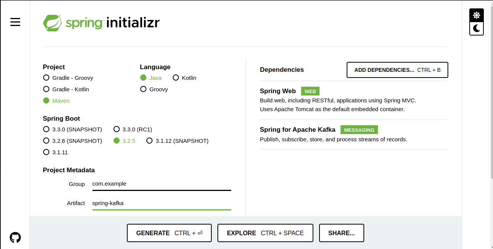
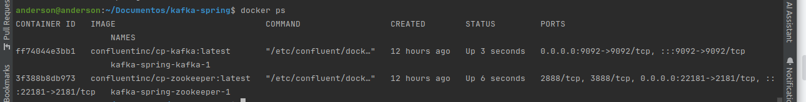

# kafka-spring
### O que é Apache Kafka?
Apache Kafka é uma plataforma de streaming distribuída que é utilizada para construir pipelines de dados em tempo real e aplicações de streaming. Ele é especialmente projetado para lidar com grandes volumes de dados de forma eficiente e confiável. O Kafka é conhecido por sua alta capacidade de escalabilidade e tolerância a falhas, sendo amplamente adotado por empresas para casos de uso como mensageria, processamento de streams, armazenamento de logs e integração entre sistemas.

#### Principais conceitos do Kafka incluem:

- **Tópicos (Topics)**: Canais de mensagens onde os dados são publicados.
- **Produtores (Producers)**: Aplicativos que publicam dados em tópicos.
- **Consumidores (Consumers)**: Aplicativos que se inscrevem nos tópicos e consomem os dados.
- **Brokers**: Servidores Kafka que armazenam os dados e coordenam a comunicação entre produtores e consumidores.
- **Partições (Partitions)**: Cada tópico é dividido em partições para distribuir dados e paralelizar o processamento.

#### O que é Spring Boot?
Spring Boot é um projeto da família Spring Framework que simplifica o desenvolvimento de aplicações Java, fornecendo um ambiente pré-configurado e pronto para uso. Ele é baseado no conceito de "opinião sobre configurações", o que significa que muitas decisões de configuração são tomadas pelo próprio Spring Boot, reduzindo a necessidade de configuração manual. O Spring Boot é ideal para desenvolvimento ágil e produção rápida de aplicativos Java.

#### Principais características do Spring Boot:

- **Configuração automática (Auto-Configuration)**: O Spring Boot configura automaticamente os componentes com base nas dependências encontradas no classpath.
- **Embedded Containers**: Suporte embutido para contêineres web como Tomcat, Jetty ou Undertow.
- **Spring Boot Starter**: Pacotes que simplificam a configuração de dependências para diferentes tecnologias, como Spring Data, Spring Security, etc.

#### Kafka com Spring Boot
Quando você utiliza o Kafka com o Spring Boot, você pode facilmente integrar o Kafka em suas aplicações Java, aproveitando as facilidades oferecidas pelo Spring Boot em termos de configuração e desenvolvimento rápido.

### Aplicações e Importância do Kafka no Spring Boot

- **Integração Simplificada:** O Spring fornece o módulo `spring-kafka` que simplifica a integração do Kafka com a aplicação Spring Boot. Ele oferece abstrações e componentes que facilitam a configuração e o uso do Kafka dentro do contexto do Spring.
- **Gerenciamento de Configuração:** O Spring Boot facilita a configuração do Kafka por meio de propriedades definidas, permitindo que você configure detalhes como localização dos servidores Kafka, serialização/desserialização de mensagens, e outros parâmetros importantes.
- **Suporte a Microsserviços:** O modelo de microsserviços se beneficia muito do Kafka para comunicação assíncrona e escalável entre serviços. Com o Spring Boot, é fácil criar produtores e consumidores Kafka como componentes gerenciados.
- **Arquitetura Distribuída:** Tanto o Kafka quanto o Spring Boot são projetados para ambientes distribuídos e escaláveis. A combinação de ambos permite construir sistemas altamente disponíveis e resilientes.

#### Passos para Iniciar um Projeto Spring Boot com Kafka

1. Acesse o Spring Initializr
   Abra um navegador web e acesse o [Spring Initializr](https://start.spring.io/).
   


2. Configure o Projeto
    - **Project:** Escolha "Maven Project".
    - **Language:** Selecione "Java".
    - **Spring Boot:** Escolha a versão mais recente disponível.
    - **Group:** O grupo do pacote Java para o seu projeto (por exemplo, com.example).
    - **Artifact:** O nome do artefato do projeto (por exemplo, kafka-spring).
    - **Dependencies:** Adicione a dependência Spring for Apache Kafka e Spring Web selecionando-as na lista de dependências. Se preferir incluir diretamente no arquivo `pom.xml`, adicione da seguinte forma:
      ```xml
      <dependency>
          <groupId>org.springframework.boot</groupId>
          <artifactId>spring-boot-starter-web</artifactId>
      </dependency>
      <dependency>
          <groupId>org.springframework.kafka</groupId>
          <artifactId>spring-kafka</artifactId>
      </dependency>
      ```

3. Gerar e Baixar o Projeto
   Depois de configurar o projeto, clique no botão "Generate" para gerar o projeto Spring Boot com as dependências selecionadas. Um arquivo ZIP contendo o projeto será baixado para o seu computador.

4. Importar o Projeto no IDE
   Extraia o arquivo ZIP baixado e importe o projeto no seu IDE de desenvolvimento preferido (como IntelliJ IDEA, Eclipse, etc.) como um projeto Maven existente.


# Entendendo o Arquivo docker-compose.yml

O arquivo `docker-compose.yml` define e configura dois serviços usando imagens do Docker do Confluent Kafka:

1. **Serviço Zookeeper**
   - **Imagem:** confluentinc/cp-zookeeper:latest
   - **Configuração:**
      - `hostname`: Nome do contêiner (opcional).
      - `environment`: Variáveis de ambiente para configurar o Zookeeper.
         - `ZOOKEEPER_CLIENT_PORT`: Porta para conexões de clientes.
         - `ZOOKEEPER_TICK_TIME`: Tempo de tick do Zookeeper em milissegundos.
      - `ports`: Mapeamento de porta para acessar o Zookeeper fora do contêiner (22181:2181).

2. **Serviço Kafka**
   - **Imagem:** confluentinc/cp-kafka:latest
   - **Dependências:** Dependente do serviço Zookeeper.
   - **Configuração:**
      - `hostname`: Nome do contêiner (opcional).
      - `depends_on`: Indica que este serviço depende do serviço Zookeeper.
      - `ports`: Mapeamento de porta para acessar o Kafka fora do contêiner (9092:9092).
      - `environment`: Variáveis de ambiente para configurar o Kafka.
         - `KAFKA_BROKER_ID`: Identificador único do broker Kafka.
         - `KAFKA_ZOOKEEPER_CONNECT`: Endereço e porta do Zookeeper (zookeeper:2181).
         - `KAFKA_ADVERTISED_LISTENERS`: Configura os protocolos e portas para clientes externos.
         - `KAFKA_LISTENER_SECURITY_PROTOCOL_MAP`: Mapeamento de protocolos de segurança para os listeners.
         - `KAFKA_INTER_BROKER_LISTENER_NAME`: Nome do listener usado para comunicação entre brokers.
         - `KAFKA_OFFSETS_TOPIC_REPLICATION_FACTOR`: Fator de replicação do tópico de offsets do Kafka.


### Tutorial: Configurando e Executando os Serviços

Vá até o diretório raiz do seu projeto Spring Boot e crie um arquivo `docker-compose.yml` dentro dele.

Adicione o seguinte conteúdo ao arquivo:


```yaml
version: '2'
services:
  zookeeper:
    hostname: zookeeper
    image: confluentinc/cp-zookeeper:latest
    environment:
      ZOOKEEPER_CLIENT_PORT: 2181
      ZOOKEEPER_TICK_TIME: 2000
    ports:
      - 22181:2181

  kafka:
    hostname: kafka
    image: confluentinc/cp-kafka:latest
    depends_on:
      - zookeeper
    ports:
      - 9092:9092
    environment:
      KAFKA_BROKER_ID: 1
      KAFKA_ZOOKEEPER_CONNECT: zookeeper:2181
      KAFKA_ADVERTISED_LISTENERS: PLAINTEXT://kafka:9092,PLAINTEXT_HOST://kafka:29092
      KAFKA_LISTENER_SECURITY_PROTOCOL_MAP: PLAINTEXT:PLAINTEXT,PLAINTEXT_HOST:PLAINTEXT
      KAFKA_INTER_BROKER_LISTENER_NAME: PLAINTEXT
      KAFKA_OFFSETS_TOPIC_REPLICATION_FACTOR: 1
```
Inicie os serviços usando o Docker Compose:

```bash
docker-compose up -d
```

ou

```bash
docker compose -f docker-compose.yml up -d
```

O Docker Compose irá baixar as imagens necessárias e iniciar os contêineres de Zookeeper e Kafka.

Verifique os contêineres em execução:

```bash
docker-compose ps
```

Isso mostrará os contêineres e seus estados.




Com esses passos, você configurou e iniciou um ambiente local de Zookeeper e Kafka usando Docker. Agora você pode prosseguir no desenvolvimento da aplicação Spring Boot que se conecte ao Kafka utilizando as configurações fornecidas no `docker-compose.yml`.


### Configurando o Kafka no Spring Boot

Para começar, vamos configurar o Kafka em nossa aplicação Spring Boot. Iniciaremos adicionando as seguintes propriedades ao arquivo application.properties:

```yaml
spring.kafka.bootstrap-servers=localhost:9092
spring.kafka.consumer.group-id=meu-id-grupo
```
Aqui, `spring.kafka.bootstrap-servers` especifica o endereço do seu broker Kafka, e `spring.kafka.consumer.group-id` define o ID do grupo de consumidores para sua aplicação.

#### Criando um Produtor Kafka

Para enviar mensagens para o Kafka, precisamos criar um produtor Kafka. Primeiro, crie um novo pacote chamado com.example.kafkaspring.producer e, em seguida, adicione a seguinte classe `KafkaProducerConfig`:

```java
package com.example.kafkaspring.producer;

import org.apache.kafka.clients.producer.ProducerConfig;
import org.apache.kafka.common.serialization.StringSerializer;
import org.springframework.context.annotation.Bean;
import org.springframework.context.annotation.Configuration;
import org.springframework.kafka.core.DefaultKafkaProducerFactory;
import org.springframework.kafka.core.KafkaTemplate;
import org.springframework.kafka.core.ProducerFactory;

import java.util.HashMap;
import java.util.Map;

@Configuration
public class KafkaProducerConfig {

    @Bean
    public ProducerFactory<String, String> producerFactory() {
        Map<String, Object> configProps = new HashMap<>();
        configProps.put(ProducerConfig.BOOTSTRAP_SERVERS_CONFIG, "localhost:9092");
        configProps.put(ProducerConfig.KEY_SERIALIZER_CLASS_CONFIG, StringSerializer.class);
        configProps.put(ProducerConfig.VALUE_SERIALIZER_CLASS_CONFIG, StringSerializer.class);
        return new DefaultKafkaProducerFactory<>(configProps);
    }

    @Bean
    public KafkaTemplate<String, String> kafkaTemplate() {
        return new KafkaTemplate<>(producerFactory());
    }
}
```
Essa classe KafkaProducerConfig configura a factory de produtores do Kafka e o KafkaTemplate para enviar mensagens ao Kafka. Certifique-se de ajustar as configurações de acordo com o seu ambiente, como o endereço do servidor Kafka (bootstrap.servers) e os serializadores de chave e valor (`key.serializer` e `value.serializer`).

Com esta configuração, você está pronto para começar a enviar e receber mensagens no Kafka usando o Spring Boot. Customize e expanda esta configuração conforme necessário para atender aos requisitos da sua aplicação.


A seguir, crie uma classe MessageProducer no mesmo pacote para enviar mensagens para um tópico do Kafka:

```java
package com.example.kafkaspring.producer;

import org.springframework.beans.factory.annotation.Autowired;
import org.springframework.kafka.core.KafkaTemplate;
import org.springframework.stereotype.Component;

@Component
public class MessageProducer {

    private final KafkaTemplate<String, String> kafkaTemplate;

    @Autowired
    public MessageProducer(KafkaTemplate<String, String> kafkaTemplate) {
        this.kafkaTemplate = kafkaTemplate;
    }

    public void sendMessage(String topic, String message) {
        kafkaTemplate.send(topic, message);
    }

}
```
Nesta classe MessageProducer, usamos a injeção de dependência para obter uma instância do KafkaTemplate. O método sendMessage envia uma mensagem para um tópico Kafka específico.

Certifique-se de ajustar os parâmetros conforme necessário, como o tipo de chave e valor do KafkaTemplate, de acordo com os requisitos da sua aplicação.

Agora, você tem um produtor Kafka funcional que pode enviar mensagens para um tópico do Kafka especificado. Você pode integrar este produtor em outras partes da sua aplicação Spring Boot para enviar mensagens de forma assíncrona para o Kafka.

Agora, vamos criar um consumidor Kafka para receber mensagens do tópico do Kafka. Crie um novo pacote chamado com.example.kafkaspring.consumer e adicione a seguinte classe `KafkaConsumerConfig`:

```java
package com.example.kafkaspring.consumer;

import org.apache.kafka.clients.consumer.ConsumerConfig;
import org.apache.kafka.common.serialization.StringDeserializer;
import org.springframework.context.annotation.Bean;
import org.springframework.context.annotation.Configuration;
import org.springframework.kafka.config.ConcurrentKafkaListenerContainerFactory;
import org.springframework.kafka.core.ConsumerFactory;
import org.springframework.kafka.core.DefaultKafkaConsumerFactory;

import java.util.HashMap;
import java.util.Map;

@Configuration
public class KafkaConsumerConfig {

    @Bean
    public ConsumerFactory<String, String> consumerFactory() {
        Map<String, Object> configProps = new HashMap<>();
        configProps.put(ConsumerConfig.BOOTSTRAP_SERVERS_CONFIG, "localhost:9092");
        configProps.put(ConsumerConfig.GROUP_ID_CONFIG, "meu-id-grupo");
        configProps.put(ConsumerConfig.KEY_DESERIALIZER_CLASS_CONFIG, StringDeserializer.class);
        configProps.put(ConsumerConfig.VALUE_DESERIALIZER_CLASS_CONFIG, StringDeserializer.class);
        return new DefaultKafkaConsumerFactory<>(configProps);
    }

    @Bean
    public ConcurrentKafkaListenerContainerFactory<String, String> kafkaListenerContainerFactory() {
        ConcurrentKafkaListenerContainerFactory<String, String> factory = new ConcurrentKafkaListenerContainerFactory<>();
        factory.setConsumerFactory(consumerFactory());
        return factory;
    }

}
```
Nesta classe `KafkaConsumerConfig`, configuramos a fábrica de consumidores do Kafka usando o [ConsumerFactory](). Especificamos propriedades como o endereço do servidor Kafka (bootstrap.servers), o ID do grupo de consumidores (group.id) e os deserializadores de chave e valor (key.deserializer e value.deserializer).

Além disso, configuramos a fábrica do ouvinte Kafka `ConcurrentKafkaListenerContainerFactory`, que usaremos para criar ouvintes Kafka em outras partes da aplicação.

Certifique-se de ajustar os parâmetros conforme necessário para corresponder à configuração do seu ambiente Kafka.

Com esta configuração, estamos prontos para criar e configurar consumidores que irão ouvir mensagens dos tópicos do Kafka especificados. Continuaremos implementando a lógica do consumidor na próxima etapa.


Vamos criar uma classe MessageConsumer no mesmo pacote para ouvir mensagens do tópico do Kafka:

```java
package com.example.kafka.consumer;

import org.springframework.kafka.annotation.KafkaListener;
import org.springframework.stereotype.Component;

@Component
public class MessageConsumer {

    @KafkaListener(topics = "my-topic", groupId = "meu-id-grupo")
    public void listen(String message) {
        System.out.println("Mensagem recebida: " + message);
        // Implemente o processamento da mensagem aqui
    }

}
```
Nesta classe MessageConsumer, usamos a anotação @KafkaListener para especificar que o método listen será um ouvinte de mensagens do tópico "my-topic" para o grupo de consumidores "meu-id-grupo". Quando uma mensagem é recebida neste tópico, o método listen é invocado e o conteúdo da mensagem é impresso no console.

Agora, vamos testar nossa integração com o Kafka enviando e recebendo mensagens. Criaremos um novo controlador REST no pacote com.example.kafkaspring.controller:

```java
package com.example.kafkaspring.controller;

import com.example.kafka.producer.MessageProducer;
import org.springframework.beans.factory.annotation.Autowired;
import org.springframework.web.bind.annotation.PostMapping;
import org.springframework.web.bind.annotation.RequestParam;
import org.springframework.web.bind.annotation.RestController;

@RestController
public class KafkaController {

    private final MessageProducer messageProducer;

    @Autowired
    public KafkaController(MessageProducer messageProducer) {
        this.messageProducer = messageProducer;
    }

    @PostMapping("/send")
    public String sendMessage(@RequestParam("message") String message) {
        messageProducer.sendMessage("my-topic", message);
        return "Mensagem enviada: " + message;
    }

}
```
Neste controlador `KafkaController`, usamos a anotação `@RestController` para marcar a classe como um controlador REST. Injetamos o MessageProducer para enviar mensagens para o tópico Kafka.

O método sendMessage é mapeado para a rota /send e recebe um parâmetro message via POST. Este método utiliza o messageProducer para enviar a mensagem para o tópico "my-topic" e retorna uma resposta indicando que a mensagem foi enviada com sucesso.

Agora, execute sua aplicação Spring Boot e utilize uma ferramenta como Postman ou curl para enviar uma requisição POST para http://localhost:8080/send?message=Olá_Kafka. A mensagem será enviada para o tópico Kafka e o consumidor associado ao tópico "my-topic" e ao grupo de consumidores "meu-id-grupo" receberá e imprimirá a mensagem no console.

Certifique-se de ter o Kafka em execução.

Com isso, você testou com sucesso a integração do Kafka com o Spring Boot, enviando e recebendo mensagens por meio de uma API REST. Personalize e expanda esta implementação conforme necessário para atender aos requisitos da sua aplicação.
